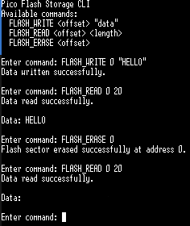
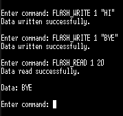
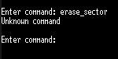
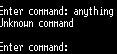
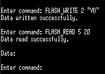
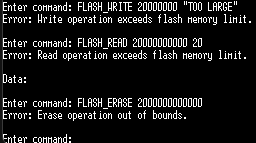
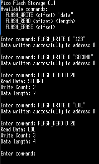
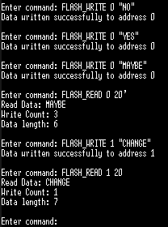

# Worksheet 1 part 1

## Table Of Contents
- [Overview](#overview)
- [Getting Started](#getting-started)
- [Essentials](#essentials)
- [Initialising Project Environment](#initialising-project-environment)
  - [Cloning the Pico SDK](#cloning-the-pico-sdk)
  - [Cloning and Building the Project](#cloning-and-building-the-project)
  - [Running the Project](#running-the-project)
  - [File Structure](#file-structure)
- [Task 1: Basic Flash Memory Operations](#task-1-basic-flash-memory-operations)
  - [Elements](#elements)
  - [Implementation Details](#implementation-details)
    - [flash_ops.h](#flashopsh)
    - [flash_ops.c](#flashopsc)
    - [cli.h](#clih)
    - [cli.c](#clic)
    - [custom_fgets.h](#custom_fgetsh)
    - [custom_fgets.c](#custom_fgetsc)
    - [main.c](#mainc)
  - [Output](#output)
- [Task 2: Structured Flash Data Storage](#task-2-structured-flash-data-storage)
  - [Changes From Task 1](#changes-from-task-1)
  - [Implementation Details](#implementation-details-1)
    - [flash_ops.h](#flashopsh-1)
    - [flash_ops.c](#flashopsc-1)
  - [Output](#output-1)


## Overview
This project demonstrates how to implement safe and persistent data storage on the Raspberry Pi Pico using its onboard flash memory. It includes a command-line interface that allows users to interact with the Pico’s flash memory directly. The project is divided into two tasks: Task 1 implements the basic functionality for reading, writing, and erasing flash memory, while Task 2 extends the system by introducing structured data storage with additional metadata.

## Getting Started
To get a copy of the project up and running on your local machine, follow these instructions.

## Essentials
* Raspberry Pi Pico SDK installed and configured
* CMake 
* Make 
* USB connection to the Pico (For uploading .uf2 file)
* A serial terminal program to interact with the Pico’s CLI (e.g Tera Term)


## Initialising Project Environment
### Cloning the pico SDK
~~~bash
git clone -b master https://github.com/raspberrypi/pico-sdk.git
cd pico-sdk
git submodule update --init
~~~
Then set the environment variable so CMake can find it:
~~~bash
export PICO_SDK_PATH=/path/to/pico-sdk
~~~
Replace /path/to/pico-sdk with the actual path where you cloned it.
### Cloning and building the project
Clone the repository:
~~~bash
    git clone https://gitlab.uwe.ac.uk/q2-alhendi/cap_template.git
~~~
To build and compile task 1 follow these steps:
~~~bash
    cd cap_template # Navigate into project directory
    mkdir build  # Create a build directory     
    cd build # navigate into build directory
    cmake .. # Generate build files 
    make # Compile project
~~~
To build and compile task 2 follow these steps:
~~~bash
    cd cap_template # Navigate into project directory
    cd task2 # Navigate into task2 directory
    mkdir build  # Create a build directory     
    cd build # navigate into build directory
    cmake .. # Generate build files 
    make # Compile project
~~~

### Running the Project
To run the project, follow these steps in order:
1. Hold the BOOTSEL button on the Raspberry Pi Pico and connect it to your computer via USB.
2. Open the build folder where the compiled .uf2 file is located.
3. Drag and drop the .uf2 file into the Pico's folder (which appears automatically).
4. Open Tera Term, select Serial, and choose the connected Pico device.
5. Use the terminal to enter the CLI commands.

### File Structure
**Hierarchical representation**
```bash
├── cap_template/
    ├── task2/
    ├── CMakeLists.txt 
    ├── pico_sdk_import.cmake   
    ├── main.c         
    ├── cli.c   
    ├── cli.h      
    ├── custom_fgets.c   
    ├── custom_fgets.h  
    ├── flash_ops.c        
    └── flash_ops.h          
```


## Task 1: Basic Flash Memory Operations
In this task, the core flash memory functions are implemented to safely interact with the Raspberry Pi Pico’s onboard flash. These functions are read, write, and erase. The implementation includes bounds checking, interrupt handling, and proper use of the Pico SDK’s flash API to ensure reliable and persistent data storage.

### Elements 
* Write functionality
* Read functionality
* Erase functionality
* Bounds checking
* Handle interrupts safely
* Command-line interface support

### Implementation Details
**flash_ops.h**:

This is the header file for the **flash_ops.c** file. It contains the declarations of the flash memory functions `flash_write_safe`, `flash_read_safe`, and `flash_erase_safe` functions.

**flash_ops.c**:

**Snippet 1**:
~~~c
#define FLASH_TARGET_OFFSET (256 * 1024) 
#define FLASH_SIZE PICO_FLASH_SIZE_BYTES 
~~~
`FLASH_TARGET_OFFSET` sets the starting point for flash operations at 256KB into the Pico’s flash.

`FLASH_SIZE` uses `PICO_FLASH_SIZE_BYTES` to represent the total size of flash memory available on the device (typically 2MB)

**Snippet 2**:
~~~c
void flash_write_safe(uint32_t offset, const uint8_t *data, size_t data_len) {
    uint32_t flash_offset = FLASH_TARGET_OFFSET + offset;
    
    if (flash_offset + data_len > FLASH_TARGET_OFFSET + FLASH_SIZE) {
        printf("Error: Write operation exceeds flash memory limit.\n");
        return;
    }
    
    uint32_t ints = save_and_disable_interrupts();
    flash_range_erase(flash_offset, FLASH_SECTOR_SIZE);
    flash_range_program(flash_offset, data, data_len);
    restore_interrupts(ints);
    
    printf("\nData written successfully.\n");
}

~~~
This snippet demonstrates the `flash_write_safe` function, which is designed to safely write data to the Pico's flash memory.  It accepts three parameters: a `data` pointer to the content being written, a `offset` indicating where the data should be written in relation to a safe region in flash `FLASH_TARGET_OFFSET`, and a `data_len` indicating the size of the data.  To make sure the operation won't go over the allotted flash space, the function first uses the `offset` to determine the actual flash address. It then does bounds checking.  `Save_and_disable_interrupts` is used to disable interrupts in order to safeguard the system during this crucial procedure. `Flash_range_erase` is used to clear the target sector since flash memory needs to be erased before it can be rewritten.  After that, `restore_interrupts` is used to restore the interrupted data, and `flash_range_program` is used to write the new data.  when its done, a success message is printed to verify that the write was completed as should.

**Snippet 3**:
~~~c
void flash_read_safe(uint32_t offset, uint8_t *buffer, size_t buffer_len) {
    uint32_t flash_offset = FLASH_TARGET_OFFSET + offset;
    
    if (flash_offset + buffer_len > FLASH_TARGET_OFFSET + FLASH_SIZE) {
        printf("Error: Read operation exceeds flash memory limit.\n");
        return;
    }
    
    memcpy(buffer, (void *)(XIP_BASE + flash_offset), buffer_len);
    
    printf("\nData read successfully.\n");
}
~~~
Snippet 3 shows the `flash_read_safe` function which handles reading the data stored in the flash memory. Before attempting to read, it performs bounds checking to confirm that the operation stays within the allocated flash space. If the requested read would exceed the limits, it prints an error message and exits early. If the operation is valid, the function copies the specified number of bytes from flash memory into the provided buffer using `memcpy`, accessing the memory through the `XIP_BASE` address space. Finally, it prints a message to confirm that the data was read correctly.

**Snippet 4**: 
~~~c
void flash_erase_safe(uint32_t offset) {
    uint32_t flash_offset = FLASH_TARGET_OFFSET + offset;
    
    if (flash_offset >= FLASH_TARGET_OFFSET + FLASH_SIZE) {
        printf("Error: Erase operation out of bounds.\n");
        return;
    }
    
    uint32_t ints = save_and_disable_interrupts();
    flash_range_erase(flash_offset, FLASH_SECTOR_SIZE);
    restore_interrupts(ints);
    
    printf("\nFlash sector erased successfully.\n");
}
~~~
Finally, this snippet illustrates the `flash_erase_safe` function, which is responsible for safely erasing a flash memory sector. It takes an `offset` to determine the specific sector to erase, then calculates the absolute address by adding the `offset` to a predefined safe starting point in flash. Before erasing, it checks that the address is within valid flash memory bounds to avoid accidental memory corruption. To ensure stability during the operation, interrupts are disabled before the erase and restored afterward. Once complete, a success message is printed to confirm the sector was erased

**cli.h**:

This is the header file for the **cli.c** file, it declares the `execute_command` function.

**cli.c**:

This file is responsible for handling user input which is captured by `custom_fgets` and executes the corresponding flash memory command. It parses the input, identifies the command, and triggers the appropriate function (read, write, or erase).

**Snippet 1**:
~~~c
void execute_command(char *command) {
    char *token = strtok(command, " ");

    if (token == NULL) {
        printf("\nInvalid command\n");
        return;
    }
~~~
The `execute_command function` handles all possible commands entered by the user via the terminal. As shown in the snippet, it begins by tokenizing the input to extract the first word (the command itself). If the input is empty, it prints an error message and exits early.

**Snippet 2**:
~~~c
if (strcmp(token, "FLASH_WRITE") == 0) {
        token = strtok(NULL, " ");
        if (token == NULL) {
            printf("\nFLASH_WRITE requires an address and data\n");
            return;
        }
        uint32_t address = atoi(token);

        token = strtok(NULL, "\"");
        if (token == NULL) {
            printf("\nInvalid data format for FLASH_WRITE\n");
            return;
        }

        flash_write_safe(address, (uint8_t *)token, strlen(token));
    }
~~~
The `FLASH_WRITE` command that the user enters through the terminal is handled by this part of the `execute_command` function.  It requires two inputs: the data string to write and the address of a memory sector. To extract the next token following the command, the function first parses the address using `strtok(NULL, " ")`.  It prints an error and ends early if no address is supplied.  The data string, which needs to be between quote marks, is then parsed.  To separate the data from the remainder of the input, `strtok(NULL, "\"")` is used. An error is shown if the data is not formatted appropriately. The code runs `flash_write_safe` when the address and data have been successfully extracted, passing the data length via `strlen` and the address and data (cast to uint8_t*).  The data is then written to the flash memory location.

 **Snippet 3**: 
 ~~~c
 else if (strcmp(token, "FLASH_READ") == 0) {
        token = strtok(NULL, " ");
        if (token == NULL) {
            printf("\nFLASH_READ requires an address and length\n");
            return;
        }
        uint32_t address = atoi(token);
        token = strtok(NULL, " ");
        if (token == NULL) {
            printf("\nInvalid length for FLASH_READ\n");
            return;
        }
        size_t length = atoi(token);
        uint8_t buffer[length];
        flash_read_safe(address, buffer, length);
        printf("\nData: %s\n", buffer);
    }
 ~~~
This part of the `execute_command` function processes the `FLASH_READ` command, which allows the user to read data from flash memory. The function begins by parsing the address using `strtok(NULL, " ")`. If the address is missing, it prints an error and exits. It then parses the length of the data to read. If the length is not provided or is invalid, an error message is also shown. Once both arguments are successfully retrieved, a local buffer of the specified length is created. The function then calls `flash_read_safe`, which is responsible for reading the flash memory at the given address and storing the result into the buffer. After the memory is read, the `execute_command` prints the content of the buffer to the terminal.

**Snippet 4**:
~~~c
else if (strcmp(token, "FLASH_ERASE") == 0) {
        token = strtok(NULL, " ");
        if (token == NULL) {
            printf("FLASH_ERASE requires an address\n");
            return;
        }
        uint32_t address = atoi(token);
        flash_erase_safe(address);
    }
~~~
This is the `FLASH_ERASE`command which is responsible for erasing a specific sector of the flash memory. The function first attempts to parse the address using `strtok(NULL, " ")`. If no address is provided, it prints an error message and exits. Once a valid address is retrieved, it is converted from string to integer using `atoi()`. The function then calls `flash_erase_safe` with the specified address. The actual erase operation, is performed inside `flash_erase_safe`, ensuring that the memory is safely cleared without affecting other regions of flash, followed by the display of a success message upon completion of the operation.

**custom_fgets.h**:

This is the header file for the **custom_fgets.c** file, it declares the `custom_fgets` function.

**custom_fgets.c**:

~~~c
char* custom_fgets(char* str, int n, FILE* stream) {
    int i = 0;
    while (i < n - 1) {
        int ch = getchar();

        if (ch == '\n' || ch == '\r') {
            str[i] = '\0';
            return str;
        } else if (ch == '\b' || ch == 0x7F) {
            if (i > 0) {
                i--;
                printf("\b \b");
            }
        } else if (ch >= 32 && ch <= 126) {
            str[i++] = (char)ch;
            printf("%c", ch);
        }
    }
    str[i] = '\0';
    return str;
}
~~~
This `custom_fgets` function in the **custom_fgets.c** file is a custom input handler designed to safely read user input from the terminal, offering more control and interactivity than the standard fgets. It reads characters one by one using `getchar` until the buffer is full or a newline is encountered.

**main.c**:

**Snippet 1**:
~~~c
int main() {
    stdio_init_all();
    char command[256];

    while (!stdio_usb_connected()) {
        sleep_ms(100);
    }

    printf("Pico Flash Storage CLI\n");
    printf("Available commands:\n");
    printf("  FLASH_WRITE <offset> \"data\"\n");
    printf("  FLASH_READ <offset>\n");
    printf("  FLASH_ERASE <offset>\n");

    while (1) {
        printf("\nEnter command: ");
        custom_fgets(command, sizeof(command), stdin);
        execute_command(command);
    }

    return 0;
}
~~~
The `main()` function serves as the entry point of the application and is responsible for initializing the system and continuously handling user commands. It begins by initializing standard I/O using `stdio_init_all()`, and then waits for a USB serial connection to be established before proceeding. Once connected, it enters an infinite loop where it prompts the user for a command. The print statements just make it clear to the user of the available commands and how to use them.

### Output 
The image below demonstrates that all three commands `FLASH_WRITE`, `FLASH_READ`, and `FLASH_ERASE` are working correctly, validating the functionality implemented in task 1. The effectiveness of `FLASH_ERASE` is confirmed by the empty read operation that follows, indicating the targeted sector was successfully cleared.



The image below shows how the write function `flash_write_safe` successfuly erases the flash sector before writing new data (rewrites)



The images below shows that invalid commands are successfuly handled. Any command other than `FLASH_WRITE`, `FLASH_READ`, and `FLASH_ERASE` trigger an error.





The image below confirms that data is only retrievable from the correct offset. After writing "YO" to offset 2, a read attempt from offset 5 returns no data, indicating the read function is correctly constrained to specific memory locations.



The output below shows how an error is displayed when the flash memory limit is exceeded by the write, read and erase operations.




## Task 2: Structured Flash Data Storage
This task builds upon Task 1 by modifying the flash write and read operations to handle structured data instead of raw bytes. The new structure includes metadata such as a write count and the length of the stored data, allowing each flash sector to track how many times it has been written to and manage the data more effectively.
### Changes From Task 1
* Transitioned from storing raw byte data to storing structured data
* Added tracking of how many times each flash sector has been written to. 
* Allowed each flash sector to act as an independent unit with its own tracked history
* The read function was updated to display the metadata alongside the user data

### Implementation Details
**flash_ops.h**:

**Snippet 1**:
~~~c
typedef struct __attribute__((packed)){
    uint32_t write_count; 
    size_t data_len;      
    uint8_t data[256];    
} flash_data_t;
~~~
This snippet defines the `flash_data_t` structure, which is used to store both the user data and associated metadata in flash memory. The structure includes a write count to track how many times a sector has been written, the length of the actual data, and a fixed-size buffer to hold the data itself. This struct is the only addition made to the header file from Task 1.

**flash_ops.c**:

**Snippet 1**:
~~~c
static uint32_t last_offset = UINT32_MAX;
~~~
To manage the write count correctly across different memory locations, a static variable `last_offset` is used to remember the last flash offset that was written to. 

**Snippet 2**:
~~~c
void flash_write_safe(uint32_t offset, const uint8_t *data, size_t data_len) {
    uint32_t flash_offset = FLASH_TARGET_OFFSET + offset;

    if (flash_offset + sizeof(flash_data_t) > FLASH_TARGET_OFFSET + FLASH_SIZE) {
        printf("Error: Write operation exceeds flash memory limit.\n");
        return;
    }
    flash_data_t existing_data;
    flash_read_safe(offset, &existing_data, 1);

    flash_data_t new_data;
    
    if (last_offset != offset) {
        new_data.write_count = 1; 
        last_offset = offset;
    } else {
        new_data.write_count = existing_data.write_count + 1; 
    }
    
    new_data.data_len = data_len;

    memset(new_data.data, 0, sizeof(new_data.data));
    memcpy(new_data.data, data, data_len); 

    uint32_t ints = save_and_disable_interrupts();

    flash_range_erase(flash_offset, FLASH_SECTOR_SIZE);

    flash_range_program(flash_offset, (const uint8_t *)&new_data, sizeof(flash_data_t));

    restore_interrupts(ints);

    printf("\nData written successfully to address %u\n", offset);
}
}
~~~
The `flash_write_safe` is updated to be responsible for safely writing a structured data block to a specified location in the Pico's flash memory. In this version, the function reads the current contents of the target sector to retrieve the previous write count and prepares a new `flash_data_t` structure to store the updated data. To ensure that the write count reflects activity per sector, a static variable `last_offset` is used to track the last written offset. If the offset has changed since the last write, the write count is reset to 1, indicating a new block is being written for the first time. If the offset remains the same, the counter is incremented from the previously stored value. This mechanism allows each flash block to maintain its own write history. The interrupt disabling and restoring logic remains unchanged from Task 1 and continues to ensure safe access to flash memory during write operations.

**Snippet 3**:
~~~c
void flash_read_safe(uint32_t offset, flash_data_t *out_data, int suppress_output) {
    uint32_t flash_offset = FLASH_TARGET_OFFSET + offset;

    if (flash_offset + sizeof(flash_data_t) > FLASH_TARGET_OFFSET + FLASH_SIZE) {
        if (!suppress_output) {
            printf("Error: Read operation exceeds flash memory limit.\n");
        }
        return;
    }

    memset(out_data, 0, sizeof(flash_data_t));

    memcpy(out_data, (void *)(XIP_BASE + flash_offset), sizeof(flash_data_t));

    uint8_t *byte_ptr = (uint8_t *)out_data;
    int is_empty = 1;
    for (size_t i = 0; i < sizeof(flash_data_t); i++) {
        if (byte_ptr[i] != 0xFF) {  
            is_empty = 0;
            break;
        }
    }
    if (is_empty) {
        memset(out_data, 0, sizeof(flash_data_t));
        if (!suppress_output) {
            printf("\nFlash sector is empty. No data available.\n");
        }
        return;
    }
    out_data->data[sizeof(out_data->data) - 1] = '\0';

    if (!suppress_output) {
        printf("\nRead Data: %s\n", out_data->data);
        printf("Write Count: %u\n", out_data->write_count);
        printf("Data length: %u\n", out_data->data_len);
    }
}
~~~
The `flash_read_safe` function is updated in Task 2 to handle structured data reads from flash memory. It begins by calculating the target address using the provided offset and ensures the read stays within the flash memory bounds. The output structure is cleared using `memset` to avoid displaying leftover or corrupted data. The function then reads a `flash_data_t` block directly from flash using `memcpy`. To verify whether the sector has been previously written to, it checks if all bytes are set to 0xFF, which would indicate that the flash is uninitialized. If so, the structure is reset and, unless `suppress_output` is enabled, a message is printed to notify the user. If valid data is present, the buffer is null-terminated and, again depending on the `suppress_output` flag, the function may print the user data along with its associated metadata (write count and data length). 

### Output
This section focuses on testing the additional features introduced in task 2. All tests from task 1 remain applicable and continue to function as expected.

The image below confirms the successful tracking of the write count.



The image below illustrates that the write count resets when changing the offset, indicating that the tracking logic is working as intended.

